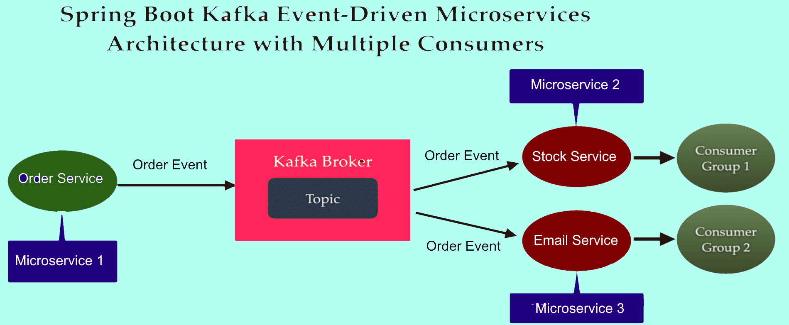

# Spring Boot 3.3 Event Driven Architecture application with Kafka 3.7

The sample code implements an Event Driven architecture using Spring Boot and Kafka.

### Note:
* Start Order, Email and Stock Services separately
* Use _sample-requests.http_ for direct testing

## Intellij Plugin
* Kafka
* HTTP
* Lombok